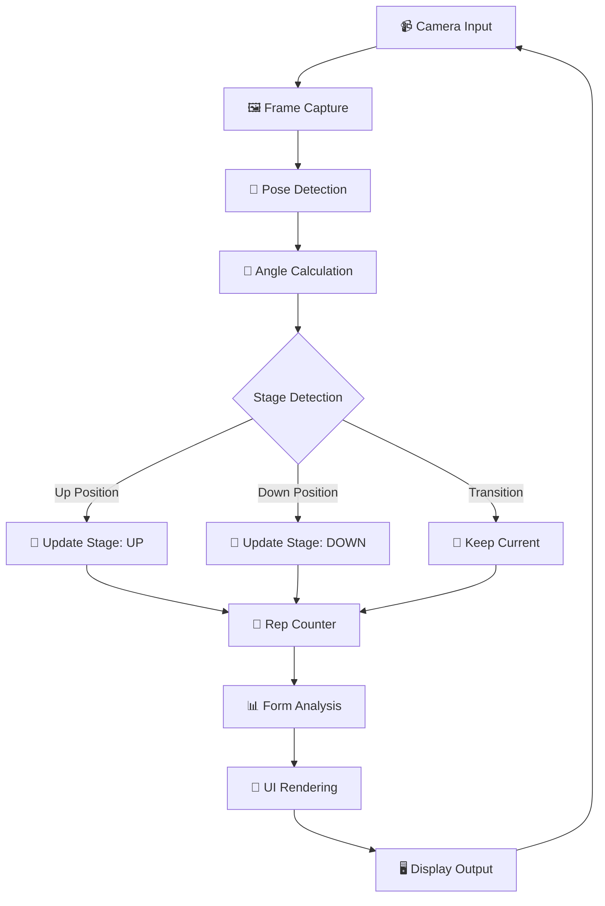

<div align="center">

# 🏋️‍♂️ AI Fitness Trainer

### Real-Time Pose Detection & Exercise Tracking System

[](https://python.org)
[](https://opencv.org)
[](https://mediapipe.dev)
[](LICENSE)

<p align="center">
  <strong>An AI-powered fitness trainer that uses computer vision to detect body poses, count exercise repetitions, and provide real-time form feedback to help you achieve perfect workout form!</strong>
</p>

---

[Features](#-features) •
[Demo](#-demo) •
[Installation](#-installation) •
[Usage](#-usage) •
[Architecture](#%EF%B8%8F-architecture) •
[How It Works](#-how-it-works) •
[Contributing](#-contributing)

</div>

---

## ✨ Features

<table>
<tr>
<td width="50%">

### 🎯 Core Features

- **Real-time Pose Detection** - Track 33 body landmarks using Google's MediaPipe AI
- **Automatic Rep Counting** - Accurate repetition counting using angle-based detection
- **Form Feedback** - Instant corrective suggestions for perfect exercise form
- **Session Statistics** - Track duration, total reps, sets, and performance metrics

</td>
<td width="50%">

### 💪 Supported Exercises

| Exercise | Target Muscles |
|----------|---------------|
| 🏋️ **Bicep Curls** | Biceps |
| 🦵 **Squats** | Quadriceps, Glutes |
| 🫸 **Push-ups** | Chest, Triceps |
| 🙆 **Shoulder Press** | Shoulders, Triceps |

</td>
</tr>
</table>

### 🎨 Visual Features

- ✅ **Professional UI Overlay** - Clean, modern interface with stats panels
- ✅ **Color-Coded Feedback** - Green (good), Yellow (warning), Red (needs correction)  
- ✅ **Progress Tracking** - Real-time session duration, RPM (reps per minute)
- ✅ **Mirror Mode** - Camera feed is flipped for natural interaction

---

## 📸 Demo

```
╔═══════════════════════════════════════════════════════════════════════════╗
║  🏋️ AI FITNESS TRAINER                           Exercise: Bicep Curl    ║
╠═══════════════════════════════════════════════════════════════════════════╣
║                                                                           ║
║  ┌─────────────────┐                           ┌────────────────────┐    ║
║  │  REPS  │ STAGE  │                           │  ⏱️ Time: 02:45     │    ║
║  │        │        │                           │  📊 Total: 24 reps │    ║
║  │   12   │  UP ⬆  │      📹 LIVE CAMERA       │  🔥 RPM: 8.7       │    ║
║  │        │        │      WITH POSE OVERLAY    │  💪 Sets: 2        │    ║
║  │ 🔵 140°│        │                           └────────────────────┘    ║
║  └─────────────────┘                                                      ║
║                                                                           ║
║           [1] Curl  [2] Squat  [3] Push-up  [4] Press                    ║
║                     [R] Reset  [Q] Quit                                   ║
║                                                                           ║
║  ┌───────────────────────────────────────────────────────────────────┐   ║
║  │  ✅ FORM FEEDBACK: Great form! Keep it up!                        │   ║
║  └───────────────────────────────────────────────────────────────────┘   ║
╚═══════════════════════════════════════════════════════════════════════════╝
```

---

## 🚀 Installation

### 📋 Prerequisites

| Requirement | Description |
|-------------|-------------|
| **Python** | Version 3.8 or higher |
| **Webcam** | Built-in or external USB camera |
| **OS** | Windows, macOS, or Linux |

### 📥 Step-by-Step Setup

#### 1️⃣ Clone the Repository

```bash
git clone https://github.com/YOUR_USERNAME/AI-Fitness-Trainer.git
cd AI-Fitness-Trainer
```

#### 2️⃣ Create Virtual Environment (Recommended)

```bash
# Windows
python -m venv venv
venv\Scripts\activate

# macOS/Linux
python3 -m venv venv
source venv/bin/activate
```

#### 3️⃣ Install Dependencies

```bash
pip install -r requirements.txt
```

#### 4️⃣ Run the Application

```bash
python main.py
```

### 📦 Dependencies

| Package | Version | Purpose |
|---------|---------|---------|
| `opencv-python` | >= 4.8.0 | Video capture & display |
| `mediapipe` | >= 0.10.0 | AI pose detection |
| `numpy` | >= 1.24.0 | Mathematical operations |

---

## 🎮 Usage

### ⌨️ Keyboard Controls

| Key | Action | Description |
|:---:|--------|-------------|
| `1` | Bicep Curl | Switch to bicep curl exercise |
| `2` | Squat | Switch to squat exercise |
| `3` | Push-up | Switch to push-up exercise |
| `4` | Shoulder Press | Switch to shoulder press exercise |
| `R` | Reset | Reset the current rep count |
| `Q` | Quit | Exit the application |

### 📝 Quick Start Guide

1. **Launch the app** - Run `python main.py`
2. **Position yourself** - Stand 6-8 feet away from your webcam
3. **Select exercise** - Press `1`, `2`, `3`, or `4` to choose an exercise
4. **Start exercising** - Perform the exercise with proper form
5. **Watch the feedback** - Follow real-time form corrections
6. **Track your progress** - Monitor reps, time, and RPM

### 💡 Tips for Best Results

> **📷 Camera Placement**
> - Position the camera at chest height
> - Ensure your full body is visible in the frame
> - Use good lighting for accurate detection

> **🏃 Exercise Tips**
> - Perform movements slowly for better detection
> - Wear contrasting clothing to the background
> - Keep good posture throughout exercises

---

## 🔄 Workflow



---

## 🏗️ Architecture

### 📁 Project Structure

```
AI-Fitness-Trainer/
│
├── 📄 main.py               # Main application entry point
│   ├── AIFitnessTrainer     # Main trainer class
│   └── FitnessTrainerUI     # UI rendering class
│
├── 📄 pose_detector.py      # MediaPipe pose detection wrapper
│   ├── PoseDetector         # Pose detection class
│   └── PoseLandmark         # Landmark ID constants
│
├── 📄 angle_calculator.py   # Geometric calculations
│   ├── calculate_angle()    # 3-point angle calculation
│   ├── calculate_distance() # Point distance
│   └── get_midpoint()       # Midpoint calculation
│
├── 📄 exercise_detector.py  # Exercise-specific logic
│   ├── ExerciseType         # Exercise enum
│   └── ExerciseDetector     # Detection & thresholds
│
├── 📄 rep_counter.py        # Repetition tracking
│   └── RepCounter           # Rep counting & stats
│
├── 📄 form_analyzer.py      # Form feedback system
│   ├── FormFeedback         # Feedback data class
│   └── FormAnalyzer         # Form analysis logic
│
├── 📄 requirements.txt      # Project dependencies
├── 📄 .gitignore           # Git ignore rules
└── 📄 README.md            # This file
```

### 🔗 Module Dependencies

```
┌─────────────────────────────────────────────────────────────────┐
│                           main.py                               │
│                    (Application Entry Point)                     │
└───────────────────────────┬─────────────────────────────────────┘
                            │
        ┌───────────────────┼───────────────────┐
        ▼                   ▼                   ▼
┌───────────────┐   ┌───────────────┐   ┌───────────────┐
│ pose_detector │   │    rep_counter │   │ form_analyzer │
│    .py        │   │       .py      │   │     .py       │
└───────┬───────┘   └───────────────┘   └───────┬───────┘
        │                                       │
        │           ┌───────────────┐           │
        └──────────►│exercise_detec │◄──────────┘
                    │    tor.py     │
                    └───────┬───────┘
                            │
                    ┌───────▼───────┐
                    │angle_calculat │
                    │    or.py      │
                    └───────────────┘
```

---

## 🧠 How It Works

### 1️⃣ Pose Detection

The system uses **Google MediaPipe Pose** to detect 33 body landmarks in real-time:

```python
# Key landmarks used for exercise detection
SHOULDER = 12    # Right shoulder
ELBOW = 14       # Right elbow  
WRIST = 16       # Right wrist
HIP = 24         # Right hip
KNEE = 26        # Right knee
ANKLE = 28       # Right ankle
```

### 2️⃣ Angle Calculation

Joint angles are calculated using vector mathematics:

```python
def calculate_angle(point1, point2, point3):
    """Calculate angle at point2 (vertex) between point1 and point3"""
    # Uses dot product formula:
    # angle = arccos((v1 · v2) / (|v1| × |v2|))
```

### 3️⃣ Stage Detection

Each exercise has specific angle thresholds:

| Exercise | Up Position | Down Position |
|----------|-------------|---------------|
| Bicep Curl | ≤ 50° | ≥ 140° |
| Squat | ≥ 160° | ≤ 90° |
| Push-up | ≥ 160° | ≤ 90° |
| Shoulder Press | ≥ 160° | ≤ 70° |

### 4️⃣ Rep Counting Logic

```python
# A rep is counted when:
if previous_stage == 'down' and current_stage == 'up':
    rep_count += 1  # Full rep completed! 🎉
```

### 5️⃣ Form Analysis

The system checks for common form mistakes:

| Exercise | Form Checks |
|----------|-------------|
| **Bicep Curl** | Elbow stability, body sway |
| **Squat** | Knee alignment, back angle, depth |
| **Push-up** | Body alignment, hand placement |
| **Shoulder Press** | Back arch, arm symmetry, elbow flare |

---

## 📊 Session Statistics

The app tracks comprehensive workout metrics:

```
╔════════════════════════════════════════╗
║         SESSION COMPLETE! 🎉           ║
╠════════════════════════════════════════╣
║  ⏱️  Duration:        15:32            ║
║  📊  Total Reps:      87               ║
║  💪  Sets Completed:  6                ║
║  🔥  Avg RPM:         5.6              ║
╚════════════════════════════════════════╝
```

---

## 🛠️ Troubleshooting

<details>
<summary><b>❌ Camera not detected</b></summary>

- Check if your webcam is connected properly
- Try a different USB port
- Close other applications using the camera
- Update your camera drivers

</details>

<details>
<summary><b>❌ Pose not detected</b></summary>

- Ensure your full body is visible in the frame
- Improve lighting conditions
- Wear contrasting clothing
- Stand 6-8 feet from the camera

</details>

<details>
<summary><b>❌ Low FPS / Lag</b></summary>

- Close background applications
- Reduce camera resolution
- Try model_complexity=0 in pose_detector.py
- Ensure adequate system resources

</details>

<details>
<summary><b>❌ Import errors</b></summary>

```bash
# Reinstall dependencies
pip uninstall opencv-python mediapipe numpy
pip install -r requirements.txt
```

</details>

---

## 🤝 Contributing

Contributions are welcome! Here's how you can help:

1. **🍴 Fork** the repository
2. **🌿 Create** a feature branch (`git checkout -b feature/AmazingFeature`)
3. **💻 Commit** your changes (`git commit -m 'Add AmazingFeature'`)
4. **📤 Push** to the branch (`git push origin feature/AmazingFeature`)
5. **🔀 Open** a Pull Request

### 💡 Ideas for Contributions

- [ ] Add more exercises (lunges, deadlifts, planks)
- [ ] Implement voice feedback
- [ ] Add workout history/logging
- [ ] Create a GUI settings menu
- [ ] Add calorie estimation
- [ ] Multi-person support

---

## 📜 License

This project is licensed under the **MIT License** - see the [LICENSE](LICENSE) file for details.

---

## 👨‍💻 Author

<div align="center">
  <table style="width: 100%">
    <tr>
      <td align="center">
        <strong>Computer Vision Semester Project</strong><br>
        <sub>
          Built with ❤️ by:
          <br><b>Name:</b> Talha Mehmood, <b>SAP ID:</b> 70158056
          <br><b>Name:</b> Syed Umer Shehzad, <b>SAP ID:</b> 70159454
          <br><b>Name:</b> Muhammad Bilal Abid, <b>SAP ID:</b> 70158113
          <br>using Python, OpenCV & MediaPipe
        </sub>
      </td>
    </tr>
  </table>
</div>

---

<div align="center">

### ⭐ If you found this project helpful, please give it a star!

**Made with 💪 for fitness enthusiasts**

</div>
